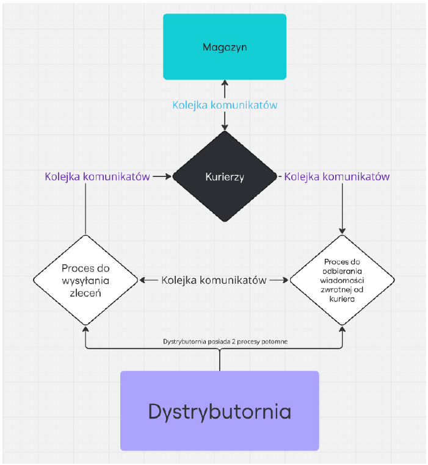

# Symulacja Systemu Dystrybucji (IPC Project)

Projekt zaliczeniowy z przedmiotu Przetwarzanie Systemowe i Współbieżne (PSiW). Aplikacja symuluje działanie dyspozytorni zamówień oraz trzech niezależnych firm magazynowych, wykorzystując mechanizmy komunikacji międzyprocesowej (IPC - kolejki komunikatów) w środowisku Linux.

## Opis projektu

System składa się z dwóch głównych programów:
1.  **Dystrybutornia** (Dyspozytornia) - generuje losowe zamówienia na surowce (A, B, C) i umieszcza je w globalnym kanale komunikacyjnym.
2.  **Magazyn** - proces reprezentujący firmę magazynową. Każdy magazyn uruchamia 3 procesy potomne (Kurierów), którzy pobierają zlecenia i próbują je zrealizować w oparciu o stany magazynowe.

Całość działa w modelu wieloprocesowym, gdzie synchronizacja i przesyłanie danych odbywa się poprzez kolejki komunikatów (`msgget`, `msgsnd`, `msgrcv`).

## Architektura i Zasada Działania

System opiera się na następującym przepływie informacji:

1.  **Inicjalizacja:** Dystrybutornia tworzy główną kolejkę komunikatów.
2.  **Rejestracja:** Magazyny po uruchomieniu wysyłają zgłoszenie gotowości do Dystrybutorni. Program główny startuje dopiero po zgłoszeniu się 3 magazynów.
3.  **Zlecanie:** Dystrybutornia losuje zamówienia i wrzuca je do kolejki.
4.  **Realizacja:** Kurierzy (procesy potomne Magazynu) pobierają zamówienia. Komunikują się ze swoim procesem macierzystym (Magazynem) poprzez dedykowaną, wewnętrzną kolejkę komunikatów, aby sprawdzić dostępność towaru i jego cenę.
5.  **Raportowanie:** Jeśli zamówienie może być zrealizowane, Kurier odsyła informację zwrotną do Dystrybutorni wraz z kosztem (GLD).

### Schemat systemu



## Wymagania i Kompilacja

Projekt przeznaczony jest na systemy Linux (wymaga bibliotek `sys/ipc.h`, `sys/msg.h`).

**Kompilacja:**

```bash
gcc dystrybutornia.c -o dystrybutornia
gcc magazyn.c -o magazyn
```

## Instrukcja Uruchomienia

Symulację należy uruchomić w 4 oddzielnych terminalach. Ważna jest kolejność uruchamiania.

### Krok 1: Terminal 1 - Dystrybutornia

Jako pierwszy uruchom proces dyspozytorni, który utworzy kolejkę komunikatów.

Składnia: ./dystrybutornia <klucz> <liczba_zamowien> <max_A> <max_B> <max_C>

Program będzie czekał na zgłoszenie się 3 magazynów.

### Krok 2, 3, 4: Terminale Magazynów

W pozostałych terminalach uruchom magazyny, podając odpowiednie pliki konfiguracyjne.

Składnia: ./magazyn <plik_konfiguracyjny> <klucz>

## Pliki Konfiguracyjne
Pliki mX_konf.txt definiują stan początkowy magazynu. Format pliku:
* **Linia 1:** Ilość surowców (A B C)
* **Linia 2:** Cena jednostkowa surowców (A B C)

## Zakończenie Symulacji
Symulacja kończy się, gdy:

1. Wszystkie zamówienia zostaną zrealizowane.
2. Magazynom skończą się surowce.
3. Kurierzy nie będą mogli pobrać nowego zlecenia przez określony czas (timeout 150s).

Na koniec programy wypisują raport:
* **Dystrybutornia:** Całkowity koszt (GLD) zapłacony za zlecenia.
* **Magazyny:** Stan surowców po zakończeniu pracy i zarobiona kwota GLD.

Struktura Plików
* `dystrybutornia.c` - Kod źródłowy procesu zarządczego.
* `magazyn.c` - Kod źródłowy procesu magazynu i kurierów.
* `m1_konf.txt`, `m2_konf.txt`, `m3_konf.txt` - Pliki konfiguracyjne dla 3 magazynów.
* `README.md` - Dokumentacja projektu.


